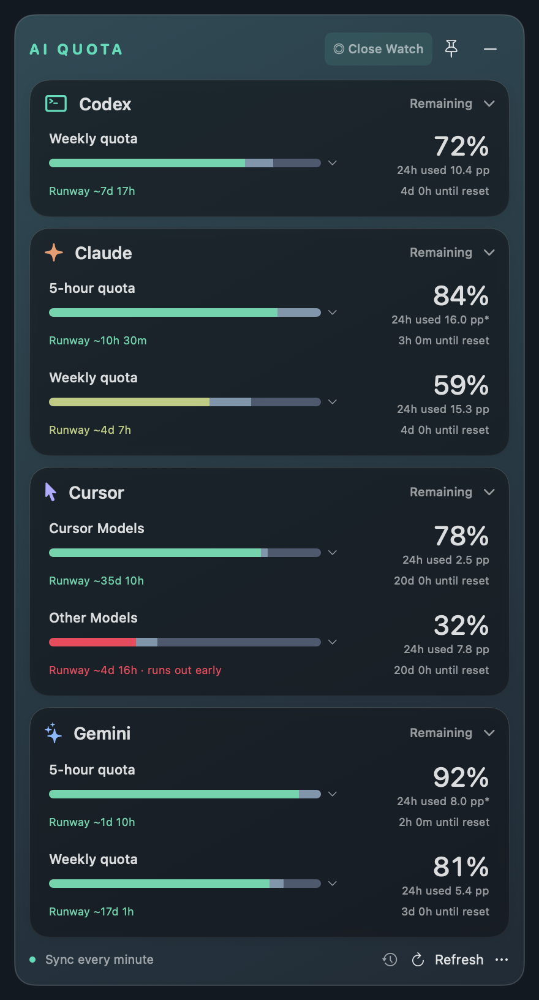
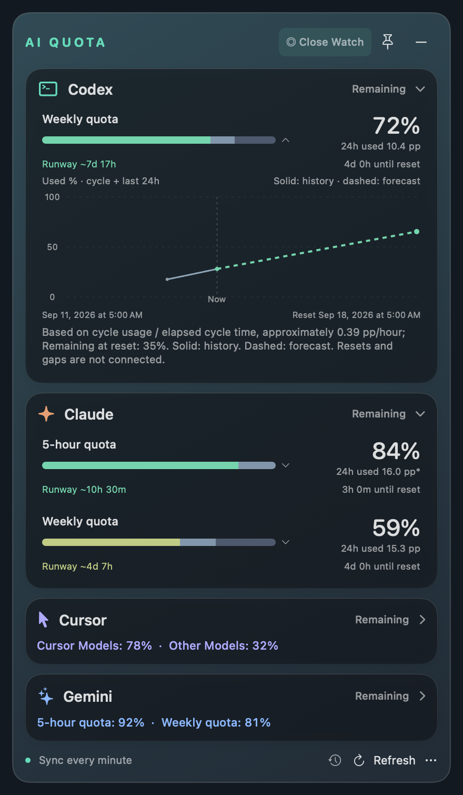
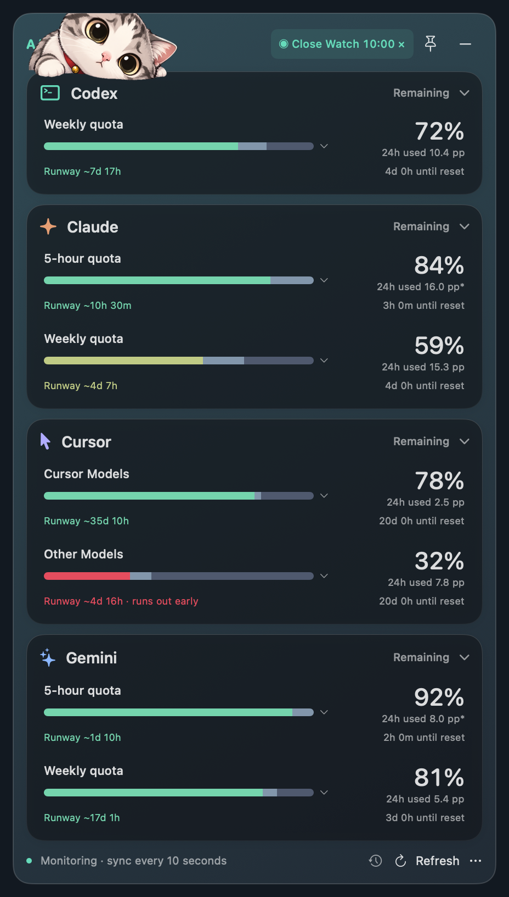

# AI Quota

[简体中文](README.zh-CN.md)

A macOS menu bar and floating dashboard for **Codex, Cursor, Claude, and Gemini subscription quotas**. See remaining percentages, recent usage, and estimated runway in one place.


This is an independent project, not affiliated with or endorsed by the providers. Quotas are percentages, **not a count of remaining tokens**. Provider support depends on the account and data returned.

## Screenshots

<p>
  
  
</p>

<p>
  
</p>

Close Watch randomly brings out one of three cats. The lounging cat rests on the first card, blinks, and occasionally twitches its ear.

Rendered from the app’s SwiftUI views using synthetic demo data. The backdrop is a fixed gradient for reproducibility; the running app uses live macOS glass.

## Build and run

Requires macOS 13 or later and a Swift 5.9+ toolchain (Xcode command-line tools). Local verification has been on Apple Silicon; Intel and the minimum macOS version have not been validated.

```sh
git clone https://github.com/derekfool/ai-quota.git
cd ai-quota
swift test
./build.sh
open "dist/AI Quota.app"
```

The build produces an ad-hoc signed local app for your current architecture. Developer ID signing, notarization, and clean-Mac download installation have not been validated. Build from source; no downloadable release is promised by these instructions.

## Connect accounts

- **Codex:** sign into your locally installed Codex with your ChatGPT account. The app reads quotas through `codex app-server`. If detection fails, use **More → Choose Codex Executable…**. Codex is not bundled.
- **Cursor:** use **More → Connect Cursor Account**, sign into the official page in the app, then close the login window and refresh. Intended for personal Pro / Pro+ / Ultra subscriptions.
- **Claude:** use **More → Connect Claude Account** for Pro / Max subscription usage, including Claude Code. Select a workspace in More if multiple workspaces are returned.
- **Gemini:** use **More → Connect Gemini Account** for a personal Google AI subscription in the Gemini website/app, not API or CLI quotas.

The web sign-ins use the app's persistent WebKit store, separate from Chrome. Existing Chrome sign-in does not sign this app in. Missing quota windows are not invented; plans and provider responses can differ.

## Use

- Menu bar numbers are remaining percentages: **CX** Codex, **CU** Cursor, **CL** Claude, **GM** Gemini. **5h / W** mean five-hour / weekly; Cursor **C / O** mean Cursor Models / Other Models. `!` means stale or failed; `—` means unavailable.
- Click card headings to collapse; use **More → Reorder Cards** to reorder. Window height follows content, with scrolling when necessary.
- Pinning keeps the window above other apps across Spaces. Unpinned, it belongs to its desktop. The minus button hides it; the menu dashboard or reopening the app restores it.
- Normal refresh is every minute and on wake. **Close Watch** refreshes all providers immediately and every 10 seconds. Choose 1, 5, 10, or 30 minutes in More (default 10); the choice applies to the next session. Click again to stop. Slow requests do not overlap.
- Each metric shows last-24-hour consumption. Click its bar for observed cycle usage and a dashed forecast. Remaining quota is green/yellow/red according to estimated runway; white means no reliable forecast. Muted segments show recent and earlier usage.
- Forecasts are estimates, not guarantees. Long cycles use recent cross-cycle history during their first 24 hours; five-hour cycles retain a shorter warmup. Gaps are not filled with invented observations; `*` marks partial history.
- Changes highlight the affected metric and can play sounds. More includes mute, two sound themes, and previews that do not alter real quotas.
- **English / 简体中文** are directly selectable in More. The choice persists; provider websites keep their own language behavior.

## Privacy and limitations

See [data handling](docs/privacy.md), [known limitations](docs/limitations.md), [contribution guide](CONTRIBUTING.md), and [open-source preparation tasks](docs/open-source-tasks.md).

The app stores cache/history locally and has no app-authored analytics or cloud-sync backend. Official websites and the Codex subprocess still contact their services. Website adapters are not guaranteed public APIs and can break when providers change them. Never post cookies, tokens, raw account responses, or unredacted screenshots in issues.

MIT licensed; see [LICENSE](LICENSE) and [asset provenance](ASSET_PROVENANCE.md).

[System design](docs/design.md) · [Verification records](docs/verification.md)
