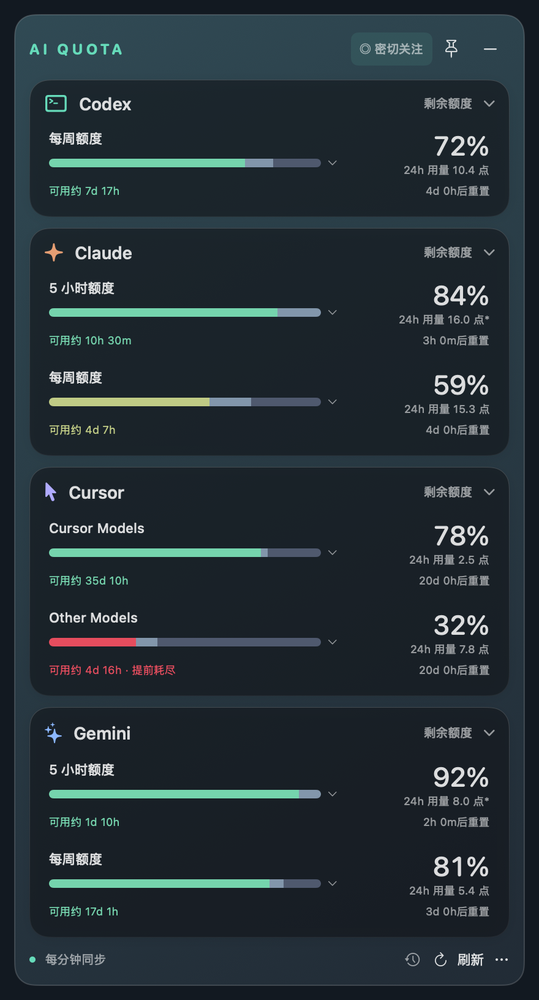
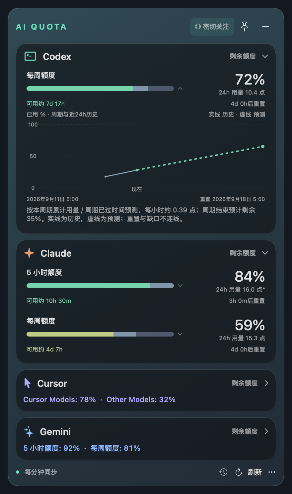

# AI Quota

[English](README.md)

macOS 菜单栏和桌面悬浮窗，集中显示 **Codex、Cursor、Claude、Gemini 订阅额度**、近 24 小时用量和预计可用时间。


本项目独立开发，与各提供商无隶属或背书关系。显示的是额度百分比，**不是剩余 token 数量**；可用指标取决于账号和实际返回数据。

## 界面展示

<p>
  
  
</p>

使用 App 的 SwiftUI 界面代码和合成演示数据渲染。为保持展示一致，背景使用固定渐变；运行中的 App 使用 macOS 实时毛玻璃。

## 从源码构建

要求 macOS 13+、Swift 5.9+ 工具链（Xcode 命令行工具）。目前本机验证为 Apple Silicon；Intel 和最低 macOS 版本尚未验证。

```sh
git clone https://github.com/derekfool/ai-quota.git
cd ai-quota
swift test
./build.sh
open "dist/AI Quota.app"
```

生成当前机器架构的本地临时签名 App，尚未完成 Developer ID 签名、公证或独立 Mac 下载安装验证。这里提供源码构建方式，不承诺已有安装包。

## 连接账号

- **Codex**：先在本机 Codex 使用 ChatGPT 账号登录；通过 App Server 读取额度。找不到程序时，在更多菜单选择可执行程序。本项目不捆绑 Codex。
- **Cursor**：更多 → 连接 Cursor 账号，在 App 内官方页面登录，关闭登录窗口后刷新。适用于个人 Pro / Pro+ / Ultra 订阅。
- **Claude**：更多 → 连接 Claude 账号，读取 Pro / Max 订阅（含 Claude Code）用量；多个工作区时在更多菜单选择。
- **Gemini**：更多 → 连接 Gemini 账号，针对 Gemini 网页/App 的个人 Google AI 订阅，不是 API 或 CLI 额度。

网页使用 App 自己的持久化 WebKit 登录环境，不共享 Chrome 登录。提供商没有返回的额度不会补成 100%。

## 使用

- 菜单栏 CX / CU / CL / GM 分别表示四家平台；5h / W 为五小时/每周，Cursor C / O 为 Cursor Models / Other Models。数字为剩余百分比；`!` 表示过期或读取失败，`—` 表示暂无数据。
- 卡片标题可折叠；更多 → 调整卡片顺序。窗口高度随内容调整，超出屏幕时滚动。
- 图钉开启时置顶并跨桌面；关闭时留在所在桌面。减号隐藏窗口，从菜单栏或重新打开 App 可恢复。
- 正常每分钟及唤醒后刷新。顶部**密切关注**统一控制四家：立即刷新，之后每 10 秒刷新，默认 10 分钟。更多菜单可选 1/5/10/30 分钟，下次开启生效；再次点击可提前结束。慢请求不重复叠加。
- 剩余百分比下方显示近 24 小时消耗，点击进度条展开历史和预测。剩余段按预计是否够用显示红黄绿；白色表示无法可靠预测。低饱和段显示近期和更早已用。
- 预测不是保证：长周期开始不足 24 小时时参考跨周期近期历史，五小时周期保留较短预热规则。缺失区间不补画；`*` 表示历史不完整。
- 额度变化会高亮具体指标并播放可静音的音效；更多菜单可选两套音色和预览，预览不改变真实数据。
- 更多菜单直接选择 **简体中文 / English**，即时切换并保存；官方网页仍使用各自语言。

## 数据和限制

缓存位于 `~/Library/Application Support/AIQuota/quota-cache.json`，历史位于同目录 `quota-history.json`；重启后保留。偏好由 macOS UserDefaults 保存，网页登录由 WebKit 保存。失败保留旧数据并标记过期。

本应用没有自行实现的分析上传或云同步后端，但官方网页和 Codex 子进程仍会联网。网页用量接口不是承诺稳定的公开 API。不要把 Cookie、Token、原始账号响应或未脱敏截图上传到 issue。

完整说明：[数据处理](docs/privacy.md)、[已知限制](docs/limitations.md)、[贡献指南](CONTRIBUTING.md)、[开源任务](docs/open-source-tasks.md)、[系统设计](docs/design.md)。详细开发文档目前主要使用英文或历史中文。

采用 [MIT 许可证](LICENSE)，素材来源见 [ASSET_PROVENANCE.md](ASSET_PROVENANCE.md)。
